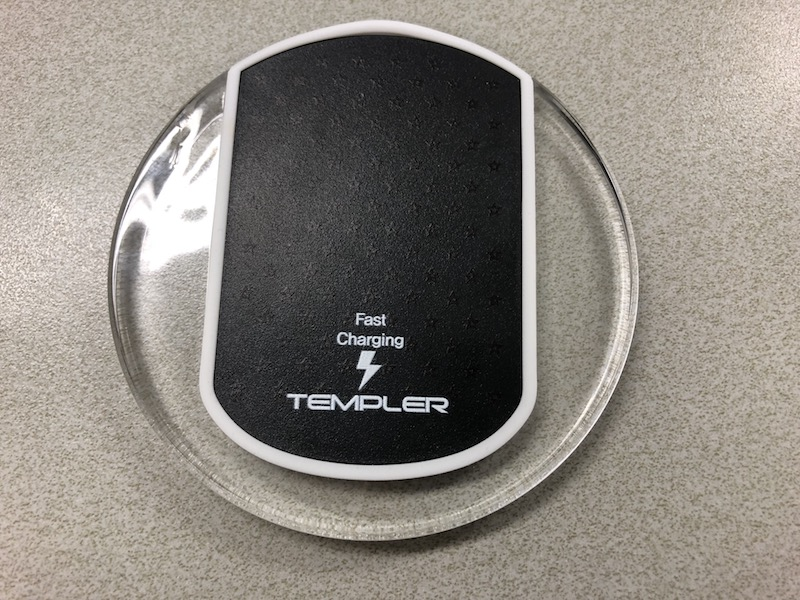
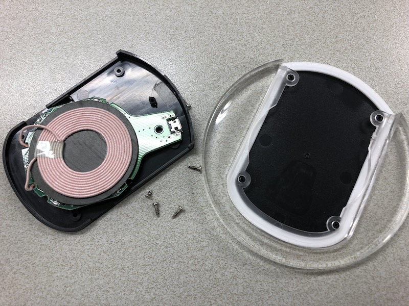
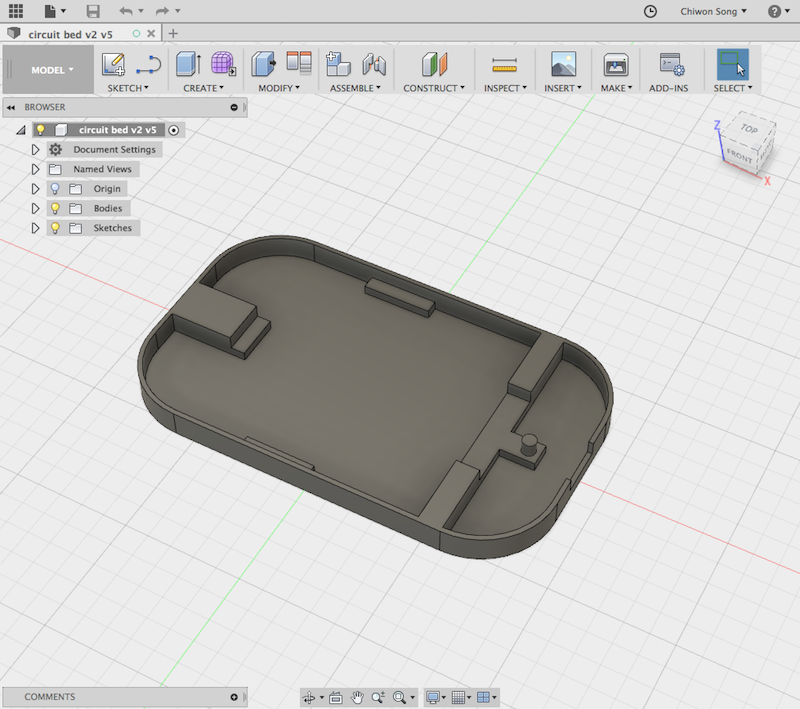
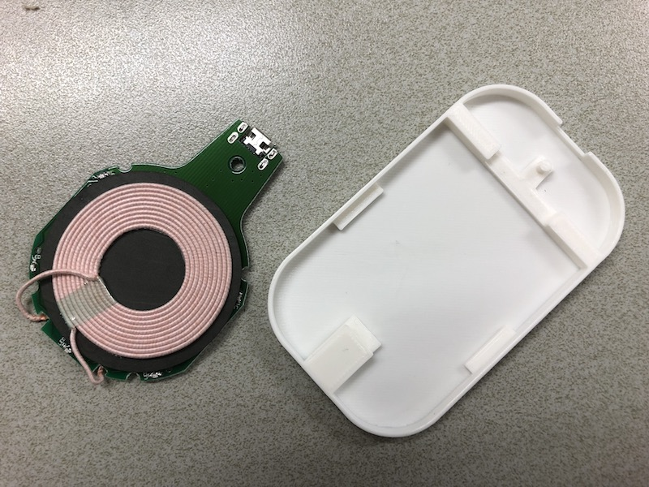
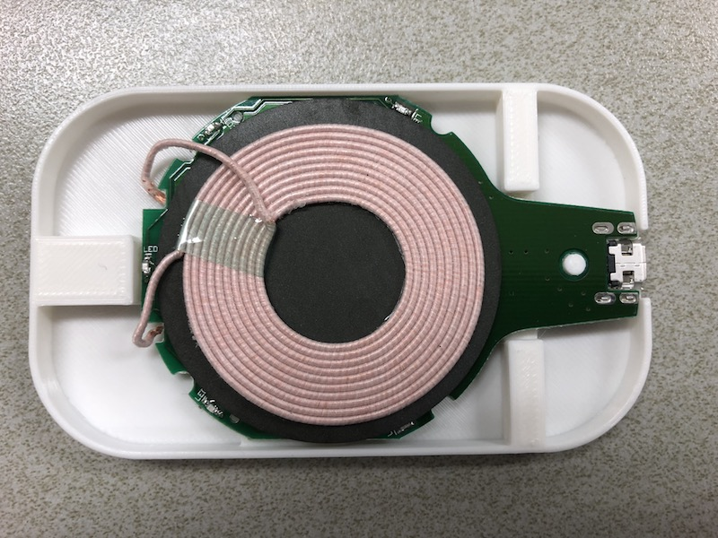
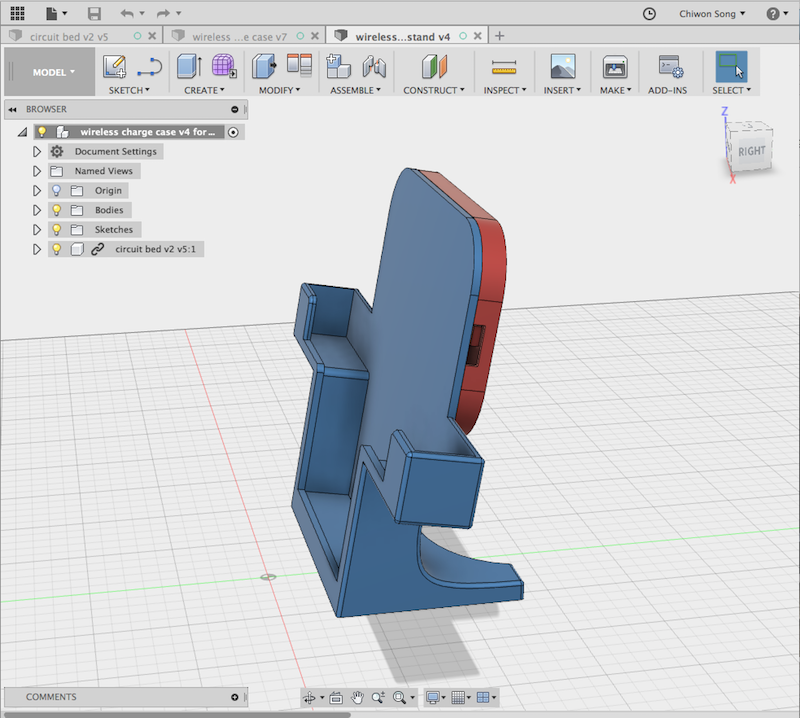
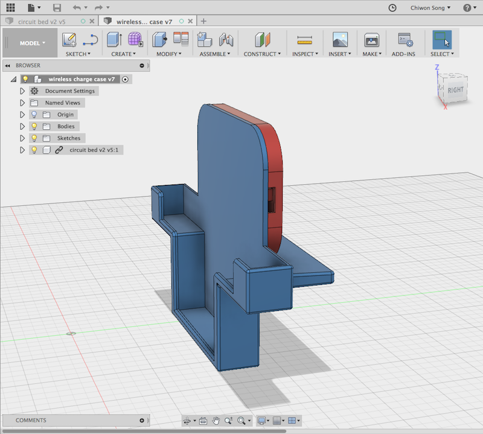

# WirelessCharger
iPhone8 용 무선충전 핸드폰 거치대 만들기 프로젝트

- - -

## 1. 무선충전 모듈

무선 충전 모듈을 별로도 구매할 수 있겠지만, 고속충전을 위해서 저렴한 고속충전기를 사서 분해하여 모듈을 얻는 것으로 하였다.

[상품링크](http://www.eleparts.co.kr/goods/view?no=4262992)

## 2. 모델링

Fusion360 으로 모델링하고 3D 프린터로 출력하여 거치대와, 충전모듈 커버를 만들었다.

##### 충전모듈 커버

모델링 파일: [cover.iges](modeling/cover.iges)

##### 휴대폰 거치대

iPhone8 용이고, 내가 사용하는 커버가 뒷편이 두툼한 모양이라 거치되는 공간을 넉넉하게 잡아주었다.

탁상용 거치대와 차량용 두가지 버전으로 만들었고, 차량용은 CD슬롯에 꽂을 수 있는 형태로 모델링하였다.

탁상용 모델링 파일: [desk.iges](modeling/desk.iges)

차량용 모델링 파일: [car.iges](modeling/car.iges)

## 3. 결과물

## License

MIT License

Copyright (c) 2018 Song Chiwon
